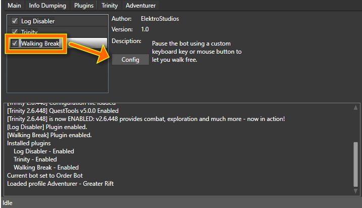
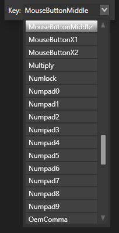

# WalkingBreak plugin for DemonBuddy

**WalkingBreak** is a plugin for **DemonBuddy** (a bot for **Diablo III** videogame),
on which you can use this plugin to specify a keyboard key or mouse button to pause/resume the bot and let you walk free this way.

------------------------

# Screenshots

------------------------

# Donations

To support me, maybe you would like to consider buying 'DevCase for .NET Framework', a powerful set of libraries for .NET developers.

Here is a link to the purchase page:

    https://codecanyon.net/item/elektrokit-class-library-for-net/19260282

Thank you.
